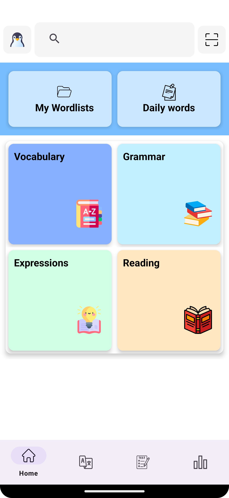
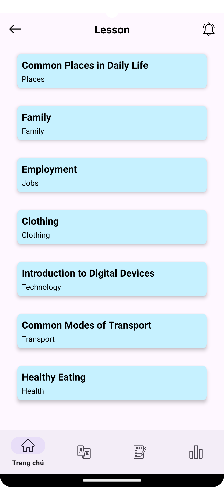

Đây là project lớn nhất đầu tiên của tôi. Là 1 app mobile học Tiếng Anh. 
(This is my first biggest project that i've ever made. An English Learning Mobile App)
## IntroActivity

## Login and SignUp

Layout for Log In and Sign Up. I use Firebase Authentication for storing data and authorization when 
users want to create a new account. Btw, if you already have an account so let's move on ...

<table>
  <tr>
    <td>
        
       
      
Sign Up

    </td>
    <td>
        
       
      
Log In

    </td>
  </tr>
</table>

## HomeFragment 
- So basically my app is for Vietnamese users want to learn English and have a desire to improve 
their English.
- Firstly, i have a Vocabulary Section which is arranged from A1-B2 level based on Cambridge (I still
  develop it to arrange from each subject)
- Secondly, I have grammar section. I divide this GrammarFragment section by level A1-B2.
  Also it contain many other sections that user can choose to learn. Honestly, just a few pictures
that i capture (cuz i'm lazy to create data for this bruhhhh...)
- The Expression and Reading section sill under developing progress
<table>
  <tr>
    <td>
        
       
      
Home

    </td>
    <td>
        
       
      
Grammar

    </td>
  </tr>
</table>

## Search Word By Using Free Dictionary API
- In this part i use free dictionary api: https://dictionaryapi.dev/
- All the usages is depends on all you use this API
- If you want to utilise this free API you may have to using RecyclerView, Adapter.
- First create a SearchBar (HomeFragment) and a listener which delivers your searched word to 
SearchedWord Activity. In this SearchedWordActivity, you have to create 2 RecyclerView, the first 
one is for displaying the audio and phonetics, and one is for displaying word definitions, part of
speech, examples, ....

 

## TranslateFragment 
- In this Fragment, I intend to create Language Translator that using Firebase natural language model and some open-source
library and some python code.
- My first goal is create just a simple translator that translate between English and Vietnamese.

<table>
  <tr>
    <td>
        
       
      
Translate En-Vn

    </td>
    <td>
        
       
      
Translate Vn-En

    </td>
  </tr>
</table>

## Vocabulary Learning Section 
- In this section you can learn some Vocabulary which is sorted by level based on Cambridge CERF. As 
I still add some vocab in database so i only add A1-B1 vocabulary. 

<table>
  <tr>
    <td> 
Level
</td>
    <td> 
A1
</td>
    <td> 
A2
</td>
  </tr>
</table>

- Inside each topic, ENG2UTC have bunch of words that include their pronunciation, part of speech, image,
also vietnamese meaning and audio. That all store in firebase storage.

<table>
  <tr>
    <td> 
A1_Zoo
</td>
    <td> 
A1_Emotions
</td>
    <td> 
A2_Places
</td>
  </tr>
</table>

## Grammar Fragment 
- In this fragment I just add use of 12 English tenses. All of tense are just some images that i copy 
from some source (P/s: ergggh)
<table>
  <tr>
    <td> 
All tenses
</td>
    <td> 
Present Simple
</td>
  </tr>
</table>

##  Setting Activity
- Like other app, my app also have some setting configuration. As i've mentioned above,
this app is created for Vietnamese users. So I only add 2 displayed language VN-ENG
- Also there will be a dark theme.
- Both language and change theme in this app, i use SharedPreference in SettingActivity and 
BaseActivity that all others Activity and Fragment are extended with.
<table>
  <tr>
    <td></td>
    <td></td>
    <td></td>

  </tr>
</table>

